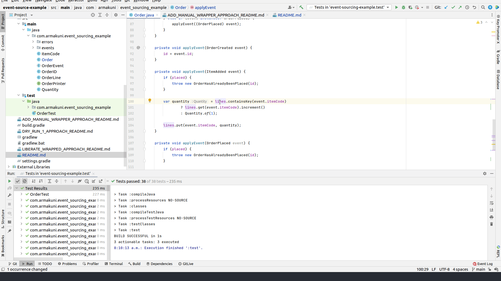

# Introduce the indirection layer
- when refactoring, we often end up in situation where single change causing cascading effects of changes and we retreat in our corner and cry, and recently, I have learned a good trick from J.B. Rainberger to introduce indirection layer to help us making small steps incrementally
- X minutes do
   - **Setup**
     - [ ] checkout https://github.com/tonytvo/introduce-indirection-layer
     - [ ] run tests, see them pass

   - It seems like `OrderLines` is a good home (domain concept) for `Order.lines` field, once you extract `Order.lines` into `OrderLines`, we could see other behaviors should belong into `OrderLines` as well
   - **adding the wrapper with manually wrap and unwrap**
     - [ ] extract all methods that references Order.lines as the following snippets
       - [ ] extract method `incrementItemQuantity`
         - 
       - [ ] extract method asList
         - 
       - [ ] extract method isEmpty
         - 
     - [ ] in method asList, create the wrapper object `OrderLines` that wrap `lines` and provide getter to return wrapped objects `lines`
       - [ ] manual introduce new object `OrderLines`, by wrapping `lines` with `OrderLines` object and immediately unwrapping (return) `lines`  
         - 
       - [ ] introduce parameter object `OrderLines`
         - 
       - [ ] move `asList` to `OrderLines`
         - 
     - follow the previous steps to move `incrementItemQuantity` to `OrderLines`
       - [ ] manual wrapping `lines` with existing object `OrderLines` and immediately unwrapping (return) `lines` 
         - 
       - [ ] introduce parameter object `OrderLines`
         - 
       - [ ] 
     - [ ] move `isEmpty` to `OrderLines` with similar steps

# References
- https://github.com/codecop/dependency-breaking-katas
- https://tonytvo.github.io/what-simple-way-share-learn-refactor/
- https://github.com/tomphp/event-sourcing-example
