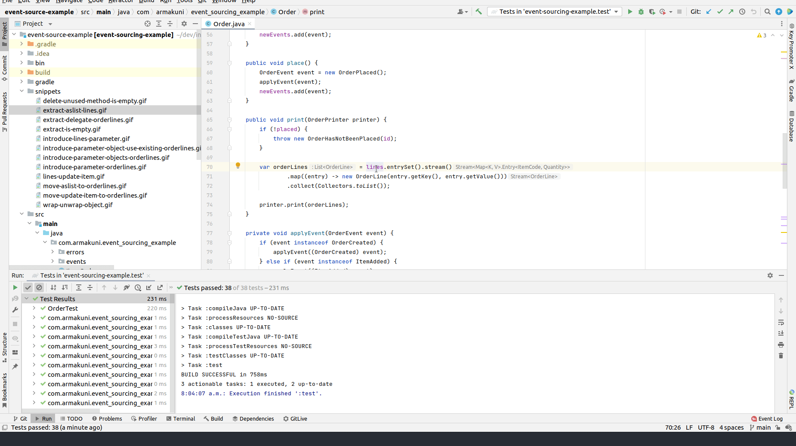

# Introduce the indirection layer
- when refactoring, we often end up in situation where single change causing cascading effects of changes and we retreat in our corner and cry, and recently, I have learned a good trick from J.B. Rainberger to introduce indirection layer to help us making small steps incrementally
- X minutes do
   - **Setup**
     - [ ] checkout https://github.com/tonytvo/introduce-indirection-layer
     - [ ] run tests, see them pass

   - It seems like `OrderLines` is a good home (domain concept) for `Order.lines` field, once you extract `Order.lines` into `OrderLines`, we could see other behaviors should belong into `OrderLines` as well
   - **liberating the wrapped**
     - [ ] extract all methods that references `Order.lines` as the following snippets
       - [ ] extract method `incrementItemCount`
         - 
       - [ ] extract method `asList`
         - 
       - [ ] extract method `isEmpty`
         - 
     - [ ] *liberating the wrapped* by extracting delegate class `OrderLines`
       -  
     - [ ] clean up, remove unused method `incrementItemCount`, `asList`, `isEmpty` in `Order`
       -  

# References
- https://github.com/codecop/dependency-breaking-katas
- https://tonytvo.github.io/what-simple-way-share-learn-refactor/
- https://github.com/tomphp/event-sourcing-example
