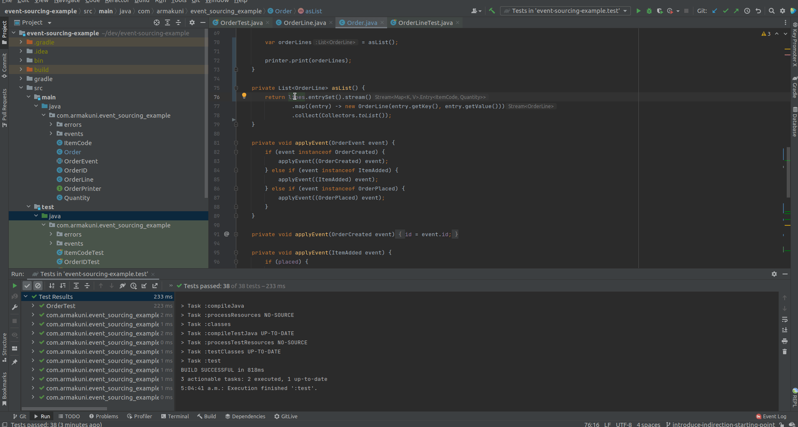
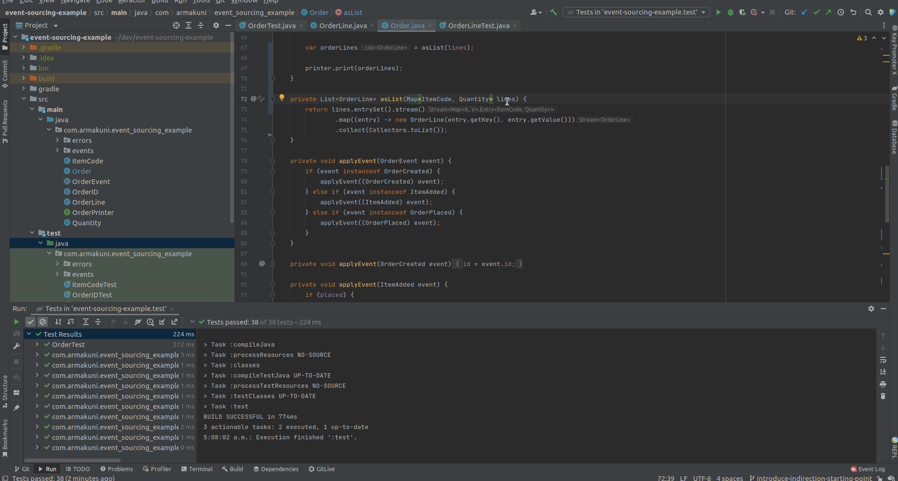
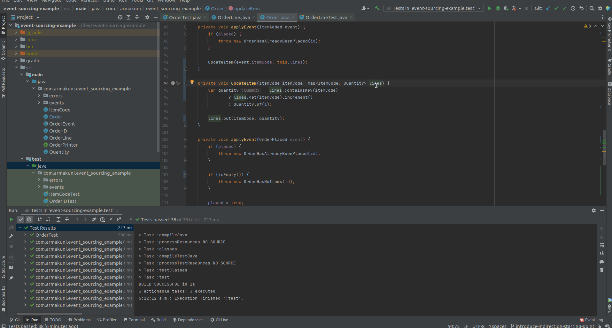

# Introduce the indirection layer
- when refactoring, we often end up in situation where single change causing cascading effects of changes and we retreat in our corner and cry, and recently, I have learned a good trick from J.B. Rainberger to introduce indirection layer to help us making small steps incrementally
- X minutes do
    - It seems like OrderLines is a good home (domain concept) for Order.lines field, once you extract Order.lines into OrderLines, we could see a whole bunch of behavior should belong into OrderLines as well
    - **Setup**
    - [ ] checkout https://github.com/tonytvo/introduce-indirection-layer
    - [ ] run tests, see them pass
    - **extract lines logic in class `Order` into methods**
      - [ ] Extract a method to check if `isEmpty()`
        -  
        - [ ] introduce parameter lines
          - 
      - [ ] Extract a method to return `asList()`
        -  
        - [ ] introduce parameter lines
      - [ ] Extract a method `incrementItemCount(ItemAdded)`
        -  
        - [ ] introduce parameter lines
    - **move lines into parameter object `OrderLines`**
      - [ ] introduce lines into parameter objects for `asList`
        -  
        - [ ] move method into `OrderLines`
          - 
      - [ ] introduce lines into existing parameter objects for `isEmpty`
        -  
        - [ ] move method into `OrderLines`
      - [ ] introduce lines into existing parameter objects for `incrementItemCount(ItemAdded)`
        - [ ] move method into `OrderLines`

# References
- https://github.com/codecop/dependency-breaking-katas
- https://tonytvo.github.io/what-simple-way-share-learn-refactor/
- https://github.com/tomphp/event-sourcing-example
